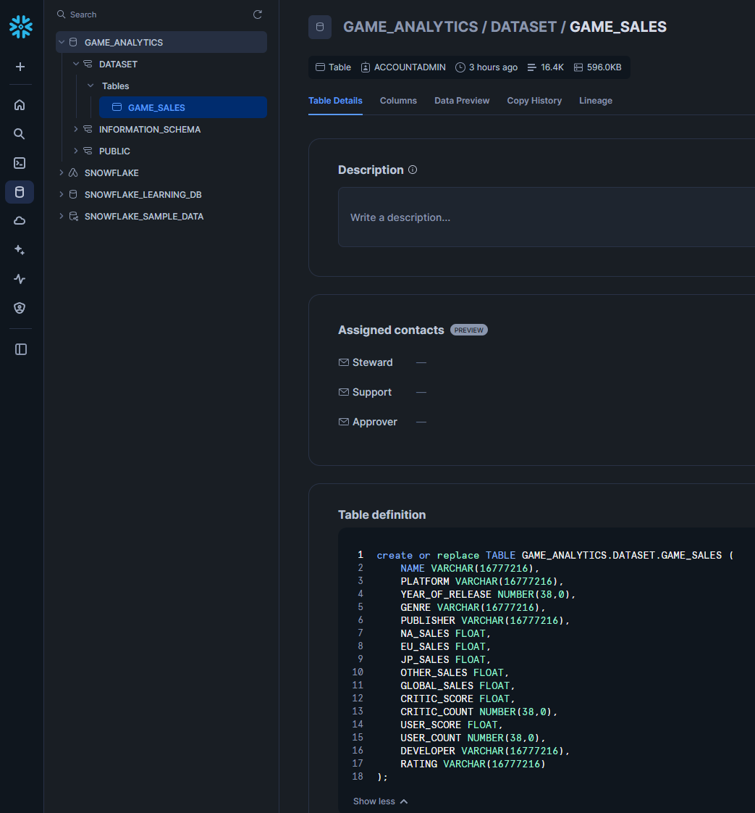
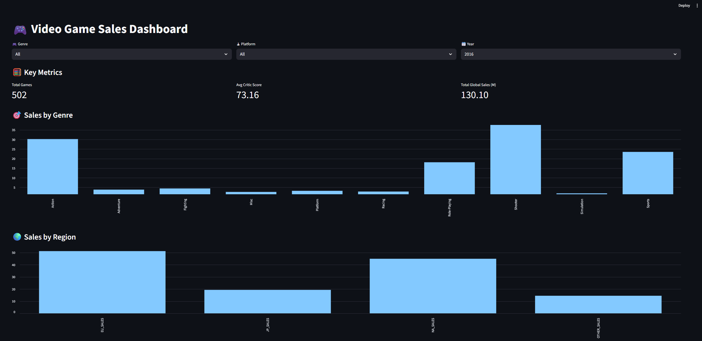
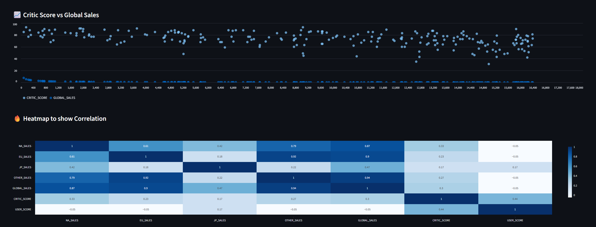
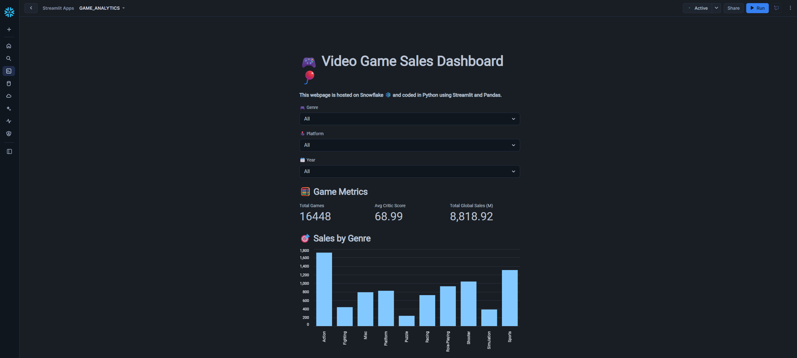
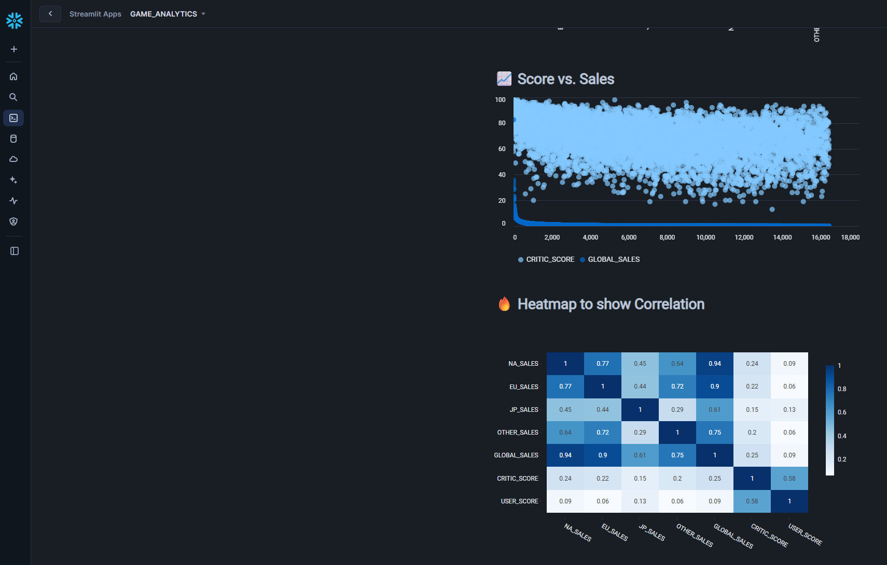

# Video Games Analytics Dashboard

This project is an interactive data analytics dashboard built using **Python**, **Streamlit**, and **Snowflake**. 
It visualizes real-world video game sales data across different platforms, genres, and regions — helping uncover patterns in critic/user scores and global revenue.
---

## Features

Dynamic filters for:
- 🎮 Genre
- 🕹️ Platform
- 🗓️ Year of Release

Visualizations:
- 🌍 Regional sales breakdown
- 📈 Critic Score vs. Global Sales
- 🎯 Top-performing genres

KPIs:
- Total games
- Total global sales (millions)
- Average critic score
---

## Tech Stack

| Tool         | Purpose                                    |
|--------------|--------------------------------------------|
| Python       | Data processing and logic                  |
| Pandas       | Data cleanup and transformations           |
| Plotly       | Data Visualization using heatmap           |
| Streamlit    | Interactive UI/dashboard                   |
| Snowflake    | Cloud data warehouse (source of truth)     |
| Snowpark     | In-Snowflake session for Native App        |
| Snowflake Connector | Uploading data from local script    |

## Folder Structure
```
video-games-analytics/
├── app/ 
│ └── dashboard.py # Streamlit dashboard (local)
│ └── snowflake.py # Streamlit dashboard (Native in Snowflake)
├── scripts/
│ └── data_cleanup.py # Data Cleanup (ETL)
│ └── upload_cleaned_data.py # Script to Upload data in Snowflake Database
├── data/ 
│ └── cleaned_game_sales.csv # Raw data -Source: [Video Game Sales with Ratings (Kaggle)](https://www.kaggle.com/datasets/rush4ratio/video-game-sales-with-ratings)
├── utils/
│ └── snowflake_connector.py # Secure Snowflake connection
├── .gitignore
├── requirements.txt
└── README.md
```
## Run Locally

1. Clone the repo

git clone https://github.com/RakshitVaru/VideoGame_Analytics.git
cd VideoGame_Analytics

2. Create Virtual Environment and Install Requirements

python -m venv venv
source venv/bin/activate  # or venv\Scripts\activate on Windows
pip install -r requirements.txt

3. Upate snowflake_connector.py with your details and save

SNOWFLAKE_USER=<your_user>
SNOWFLAKE_PASSWORD=<your_password>
SNOWFLAKE_ACCOUNT=<your_account_id>
SNOWFLAKE_WAREHOUSE=<your_warehouse>
SNOWFLAKE_DATABASE=<your_db>
SNOWFLAKE_SCHEMA=<your_schema>
SNOWFLAKE_ROLE=<your_role>

4. Upload your data

Either upload it using below command or by uploading the file directly in Snowflake [Retail FastAPI Docs](assets/FastAPI_Docs_Overview.png)
python scripts/upload_cleaned_data.py

5. Launch Streamlit

You can run Steamlit either from Local or Native -

Local run command - streamlit run app/dashboard.py
Native run details-
    -- Copy app/streamlit_app.py to your Streamlit section of Snowflake.
    -- Make sure to include all the dependencies in the package section of Streamlit Apps
    -- Click Run, if not automatically started.

## Screenshots
- **Snowflake Database Configuration and DataLoad Native Alternative**




- **Steamilt Dashboard hosted locally**



- **Steamilt Dashboard hosted on Snowflake**


